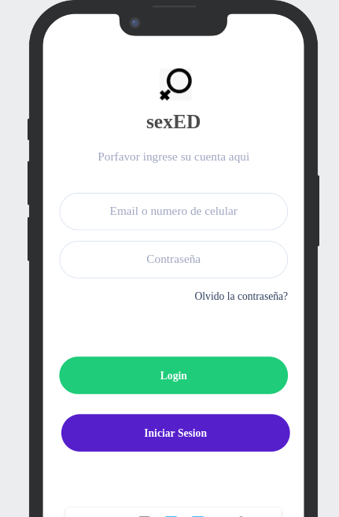
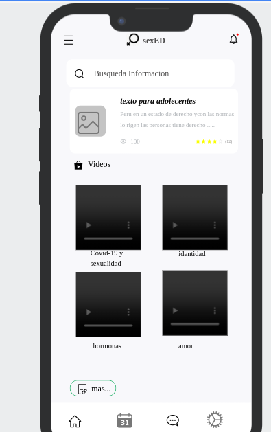
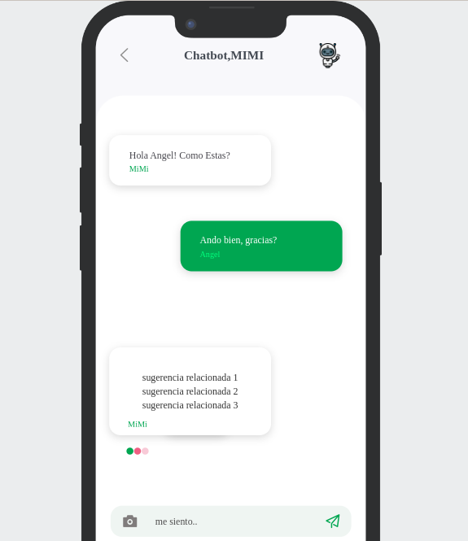

# IS-3grupo2-2023
# sexED 
_sexED (sexual education) es una aplicación móvil diseñada para brindar educación sexual de manera accesible y confiable. Nuestro objetivo es proporcionar información precisa y relevante sobre salud sexual y relaciones saludables._

## Características de la aplicación  📋
* Acceso a contenido educativo sobre temas de educación sexual.
* Interacción con un chatbot para respuestas a preguntas comunes.

## Objetivos de la aplicación  📋
* Facilitar el acceso a información actualizada y confiable sobre educación sexual.
* Fomentar una actitud positiva y respetuosa hacia la sexualidad.
* Proporcionar herramientas interactivas y recursos educativos.
* Promover la prevención de embarazos no deseados.
* Implementar un chatbot.

## Mockups  📋

## Documentación 📋

Encontrarás documentación detallada sobre la especificacion de requisitos en [Requisitos](docs/is3_doc_req.pdf).

Adicionalmente aqui se encuentra el espacio de trabajo creado en Trello [Tablero](https://trello.com/b/EqBpKCVb/educaci%C3%B2n-sexual)

## Construido con 🛠️

* [React Native](https://reactnative.dev/)
* [NodeJS](https://nodejs.org/es)

## Instalación 🛠️

1. Clona este repositorio en tu máquina local.
2. Instala las dependencias necesarias.
3. Ejecuta la aplicación en tu dispositivo o emulador.

## Contribución 🖇️

_¡Estamos abiertos a recibir contribuciones! Si tienes alguna idea, mejora o corrección, no dudes en hacer una solicitud de extracción._

## Equipo ✒️
- [Yanqui Vera Henry Aron](https://github.com/hyanquiv)
- Vilca Alvites Cecilia del Pilar
- Bejar Merma Angel Andres
- Torres Quispe Erick Jesus
- Rimache Choquehuanca Sennayda
- Bustamante Torres Luis Angel
